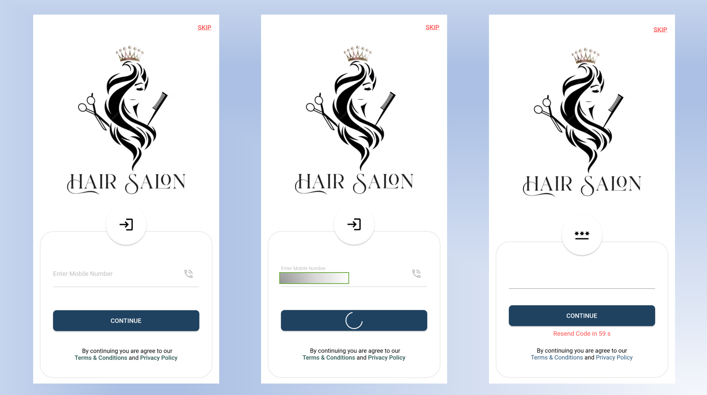

# Hair Salon App

This is a demo Hair Salon application focusing on providing various salon services to a user. 
This app provides locations, ratings and reviews of nearby salons and let the users to order a service through the app. 

## Screenshots



## Overview

- **Optimized State Management**: *Flutter Bloc* is used for optimized state management of the app. 

- **Authentication Using Phone Number**: *Firebase authentication* service, for user authentication using phone number.

- **Database Integration**: *Firestore*, a no-sql, cloud-based database is used for storing and displaying data.

- **User Friendly UI**: Clean and intuitive User Interface(UI), different status releted messages for better user experience.

## Getting Started

To test this Hair Salon App, follow these steps:

1. **Clone the Repository**: Clone this repository to your local machine using Git.
```
    $ git clone https://github.com/ayato91/SalonApp.git
```

2. **Set Up Your Flutter Environment**: Ensure you have Flutter and Dart installed on your development machine. Follow the [Flutter installation guide](https://flutter.dev/docs/get-started/install) for detailed instructions.

3. **Install Dependencies**: Navigate to the project directory and run the following command to install the app's dependencies:
```
    $ flutter pub get 
```

4. **Run the App**: Launch the app on an emulator or physical device by running the following command:
```
    $ flutter run
```

5. **Start Exploring**: Login using your phone number and OTP, start exploring about different Hair Salon services provided by this app. 


## Dependencies

The app relies on several Flutter packages and libraries, including:

- [flutter_bloc](https://pub.dev/packages/flutter_bloc) for state management of the app.
- [firebase_core](https://pub.dev/packages/firebase_core) for firebase support.
- [firebase_auth](https://pub.dev/packages/firebase_auth) for firebase authentication service.
- [cloud_firestore](https://pub.dev/packages/cloud_firestore) for using firestore database service.

For adding any package:
```
    $ flutter pub add package_name
```

You can find the complete list of dependencies in the `pubspec.yaml` file. Follow the [pub.dev](https://pub.dev) for more dependencies.


Thank You!
